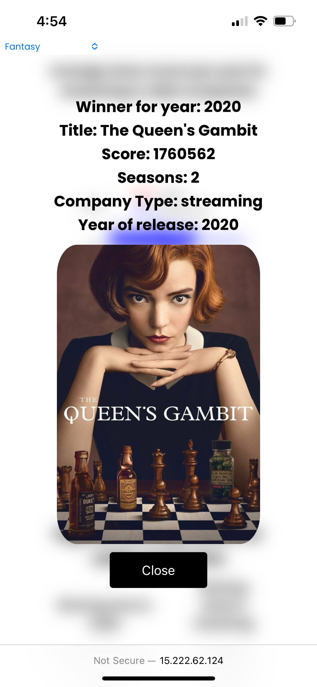
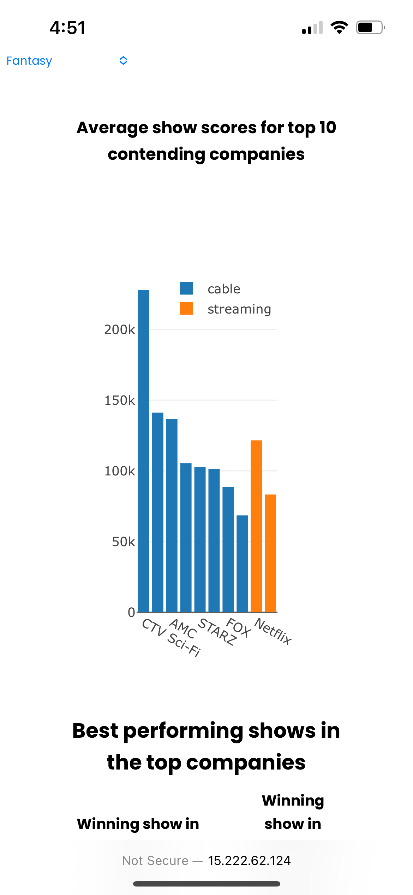
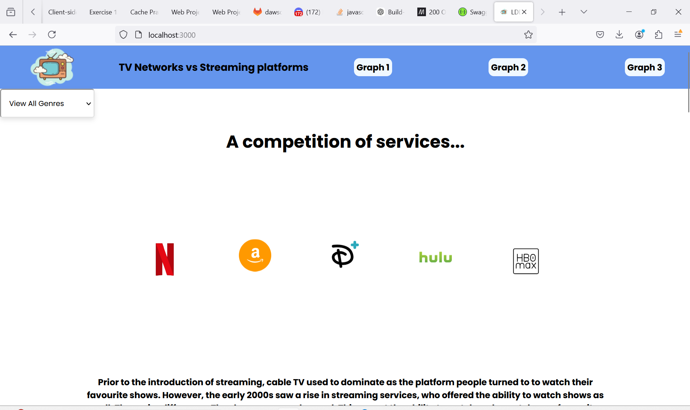
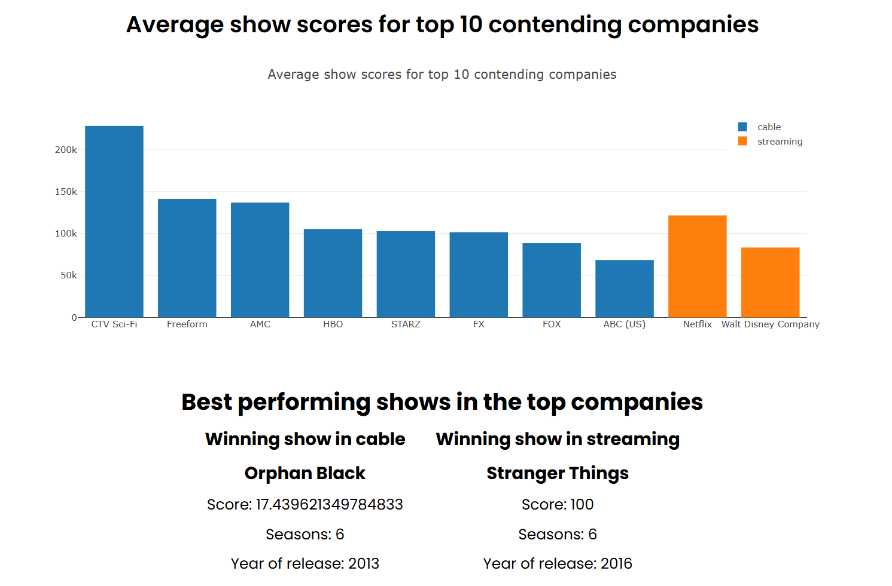

# Streaming Services VS Network Cable TV

Express + React app

Description: This app allows users to visualize the real differences between cable TV and streaming services. As technology has developed, different streaming service companies have emerged, migrating all tv content to an online platform requiring a monthly subscription to watch. But as these services have become popular, they have also become much bolder. Cancelling series after a single season when they are loved by many, and often continuing series that are of lesser interest to the general audience or lack quality. However, flaws can also be spotted in cable TV, in being that not many of their shows are very known, and oftentimes we cannot gadge their popularity because many have cancelled streaming service subscriptions. So the question becomes, which is better?

In our app, users will be able to navigate charts visualizing the differences in airtime, popularity, and awards between cable and streaming services, in order to decide themselves which is better. 

## Pictures of UI







## Structure

There are two directories in the __root__ of the project.

* The Express server is in `server/`
* The React app is in `directory/`
* The server responsd to API calls and serves the __built__ React app.

There are 3 package.json files -- see what `scripts` they define.

## Setup

To install all the dependencies and build the React app run:

```
npm run build
```

## To run the app

### Just the client

If `directory/package.json` has a `proxy` line, remove it. 

```
cd directory
npm run dev
```

### Just the server

If `directory/package.json` has a `proxy` line, remove it. 

```
cd server
nodemon api.mjs
```

**nodemon will update the server as soon as a file is changed by the developer.**

## Deployment

### Render
We deployed our app on Render. The steps to deploy:
1. In the dashboard, we selected a web service
2. Next, choose gitlab as the git provider and choose the website's repo
3. Change the language to Node
4. Choose staging as the branch
5. set the root directory as .
6. set the  build command to `cd client && npm install && npm run build && cd ../server && npm install`
7. set the start command to `cd server && node bin/www`
8. Choose the free level (or other, depending on budget)
9. Set the environment variables to the following in the environment tab:

```
ATLAS_URI=[your atlas uri for mongo db]
NODE_ENV=production
PORT=3001
```
10. Hit the start button

To re-deploy, simply push changes to your selected branch and the server will automatically re-deploy once those committed changes are pushed.

### AWS
_**NOTE**: The following steps assume you have a vhost set up to port 3001_

To deploy on the AWS server, start by checking out into the `staging` branch and make sure you've pulled all your changes. Then, follow these instructions:

1. Create a tag for your current commit and push your code to that tag:
```
git tag deployment-v1
git push origin deployment-v1
```

2. On git, locate the pipeline for this tag and download and unzip the artifact from the build-app-archive job

**DO THE FOLLOWING TO USE CRITICAL CSS FEATURE**

3. Extract the files with the following command:
```
tar -xf [release-***.tar.gz]
```

4. Locate the client directory to create a simple npm package.json and install critical:
```
cd project-directory/client
npm init
npm install critical
```

5. Run the critical script from the client directory using the provided critical.mjs file:
```
node critical.mjs
```

6. Once this is complete, you may remove the package json files and re-compress your whole project directory:
```
cd client && rm package*
cd ../..
tar -czf project-directory project.tar.gz
```

**END OF THE OPTIONAL CODE**

7. Once this is done, transfer the files over to your deployment server using your .pem key:
```
scp -i key.pem [tar-file-name].tar.gz bitnami@[your ip]:~
```

8. ssh into your server and extract the tar file:
```
tar -xf [tar-file-name].tar.gz
```

8. Cd into the server directory and npm install:
```
cd project-directory/server
npm install
```

9. Start the server using forever (install if not available with npm) and restart apache:
```
cd project-directory/server
export ATLAS_URI="your_uri"
NODE_ENV=production PORT=3001 forever start bin/www
sudo /opt/bitnami/ctlscript.sh restart apache
```

### Client and Server

In the `directory/vite.config.js`, add a `server` property to the defineConfig:
```
export default defineConfig({
  plugins: [react()],
  server: {
      proxy: {
        '/api': {
          target: 'http://localhost:3000',
          changeOrigin: true
        },
      },
    },
});
```

This makes sure that when you make a fetch to any route beginning with `/api/some-resource`, it will proxy it to `http://localhost:3000/api/some-resource` for you.

Next, open 2 terminals. 

In one terminal (for the client):
```
cd directory
npm run dev
```

In another terminal (for the server):
```
cd server
nodemon api.mjs
```

# Attributions

## API
The API used in this project is [The TVDB API](https://github.com/thetvdb/v4-api). The corresponding json retrieved from the API will be parsed in order to gather the necessary data needed for our project. A single json entry for a series is as follows:
```
{
  "data": {
    "aliases": [
      {
        "language": "string",
        "name": "string"
      }
    ],
    "averageRuntime": 0,
    "country": "string",
    "defaultSeasonType": 0,
    "episodes": [
      {
        "absoluteNumber": 0,
        "aired": "string",
        "airsAfterSeason": 0,
        "airsBeforeEpisode": 0,
        "airsBeforeSeason": 0,
        "finaleType": "string",
        "id": 0,
        "image": "string",
        "imageType": 0,
        "isMovie": 0,
        "lastUpdated": "string",
        "linkedMovie": 0,
        "name": "string",
        "nameTranslations": [
          "string"
        ],
        "number": 0,
        "overview": "string",
        "overviewTranslations": [
          "string"
        ],
        "runtime": 0,
        "seasonNumber": 0,
        "seasons": [
          {
            "id": 0,
            "image": "string",
            "imageType": 0,
            "lastUpdated": "string",
            "name": "string",
            "nameTranslations": [
              "string"
            ],
            "number": 0,
            "overviewTranslations": [
              "string"
            ],
            "companies": {
              "studio": [
                {
                  "activeDate": "string",
                  "aliases": [
                    {
                      "language": "string",
                      "name": "string"
                    }
                  ],
                  "country": "string",
                  "id": 0,
                  "inactiveDate": "string",
                  "name": "string",
                  "nameTranslations": [
                    "string"
                  ],
                  "overviewTranslations": [
                    "string"
                  ],
                  "primaryCompanyType": 0,
                  "slug": "string",
                  "parentCompany": {
                    "id": 0,
                    "name": "string",
                    "relation": {
                      "id": 0,
                      "typeName": "string"
                    }
                  },
                  "tagOptions": [
                    {
                      "helpText": "string",
                      "id": 0,
                      "name": "string",
                      "tag": 0,
                      "tagName": "string"
                    }
                  ]
                }
              ],
              "network": [
                {
                  "activeDate": "string",
                  "aliases": [
                    {
                      "language": "string",
                      "name": "string"
                    }
                  ],
                  "country": "string",
                  "id": 0,
                  "inactiveDate": "string",
                  "name": "string",
                  "nameTranslations": [
                    "string"
                  ],
                  "overviewTranslations": [
                    "string"
                  ],
                  "primaryCompanyType": 0,
                  "slug": "string",
                  "parentCompany": {
                    "id": 0,
                    "name": "string",
                    "relation": {
                      "id": 0,
                      "typeName": "string"
                    }
                  },
                  "tagOptions": [
                    {
                      "helpText": "string",
                      "id": 0,
                      "name": "string",
                      "tag": 0,
                      "tagName": "string"
                    }
                  ]
                }
              ],
              "production": [
                {
                  "activeDate": "string",
                  "aliases": [
                    {
                      "language": "string",
                      "name": "string"
                    }
                  ],
                  "country": "string",
                  "id": 0,
                  "inactiveDate": "string",
                  "name": "string",
                  "nameTranslations": [
                    "string"
                  ],
                  "overviewTranslations": [
                    "string"
                  ],
                  "primaryCompanyType": 0,
                  "slug": "string",
                  "parentCompany": {
                    "id": 0,
                    "name": "string",
                    "relation": {
                      "id": 0,
                      "typeName": "string"
                    }
                  },
                  "tagOptions": [
                    {
                      "helpText": "string",
                      "id": 0,
                      "name": "string",
                      "tag": 0,
                      "tagName": "string"
                    }
                  ]
                }
              ],
              "distributor": [
                {
                  "activeDate": "string",
                  "aliases": [
                    {
                      "language": "string",
                      "name": "string"
                    }
                  ],
                  "country": "string",
                  "id": 0,
                  "inactiveDate": "string",
                  "name": "string",
                  "nameTranslations": [
                    "string"
                  ],
                  "overviewTranslations": [
                    "string"
                  ],
                  "primaryCompanyType": 0,
                  "slug": "string",
                  "parentCompany": {
                    "id": 0,
                    "name": "string",
                    "relation": {
                      "id": 0,
                      "typeName": "string"
                    }
                  },
                  "tagOptions": [
                    {
                      "helpText": "string",
                      "id": 0,
                      "name": "string",
                      "tag": 0,
                      "tagName": "string"
                    }
                  ]
                }
              ],
              "special_effects": [
                {
                  "activeDate": "string",
                  "aliases": [
                    {
                      "language": "string",
                      "name": "string"
                    }
                  ],
                  "country": "string",
                  "id": 0,
                  "inactiveDate": "string",
                  "name": "string",
                  "nameTranslations": [
                    "string"
                  ],
                  "overviewTranslations": [
                    "string"
                  ],
                  "primaryCompanyType": 0,
                  "slug": "string",
                  "parentCompany": {
                    "id": 0,
                    "name": "string",
                    "relation": {
                      "id": 0,
                      "typeName": "string"
                    }
                  },
                  "tagOptions": [
                    {
                      "helpText": "string",
                      "id": 0,
                      "name": "string",
                      "tag": 0,
                      "tagName": "string"
                    }
                  ]
                }
              ]
            },
            "seriesId": 0,
            "type": {
              "alternateName": "string",
              "id": 0,
              "name": "string",
              "type": "string"
            },
            "year": "string"
          }
        ],
        "seriesId": 0,
        "seasonName": "string",
        "year": "string"
      }
    ],
    "firstAired": "string",
    "id": 0,
    "image": "string",
    "isOrderRandomized": true,
    "lastAired": "string",
    "lastUpdated": "string",
    "name": "string",
    "nameTranslations": [
      "string"
    ],
    "nextAired": "string",
    "originalCountry": "string",
    "originalLanguage": "string",
    "overviewTranslations": [
      "string"
    ],
    "score": 0,
    "slug": "string",
    "status": {
      "id": 0,
      "keepUpdated": true,
      "name": "string",
      "recordType": "string"
    },
    "year": "string"
  },
  "status": "string"
}
```

Some filtering needed to be made to retrieve only the series airing on main cable and streaming services. The shows we want to filter will fit the following criteria:
_A series is valid if_:
- _For ["latestNetwork"]/["originalNetwork"]["tagOptions"]["name"]: includes "cable" or "SVOD"_
- _Its country is USA, UK, or Canada, as we will focus on western media_

The final series object will resemble the following once parsing is made to retrieve necessary data:
```
{
  id : int,
  name : string,
  genre: string,
  artwork : string,
  companyID: int,
  score: int,
  numberOfSeasons: int,
  numAwards: int,
}
```

The company object will resemble the following:
```
{
  id: int,
  name: string,
  type: string,
}
```

## Dataset
The datasets used for this project have all been taken from [The TV DB](https://www.thetvdb.com/)

The official Swagger UI for their datasets and routes can be found at: [The TV DB Swagger UI](https://thetvdb.github.io/v4-api/#/)

## Libraries
As of now, we are using the Plotly library, as well as the Intersection Observer library to do some cool lazy rendering.

### Documentations can be found at:
- [Plotly Docs](https://plotly.com/javascript/)
- [Intersection Observer API](https://developer.mozilla.org/en-US/docs/Web/API/Intersection_Observer_API)